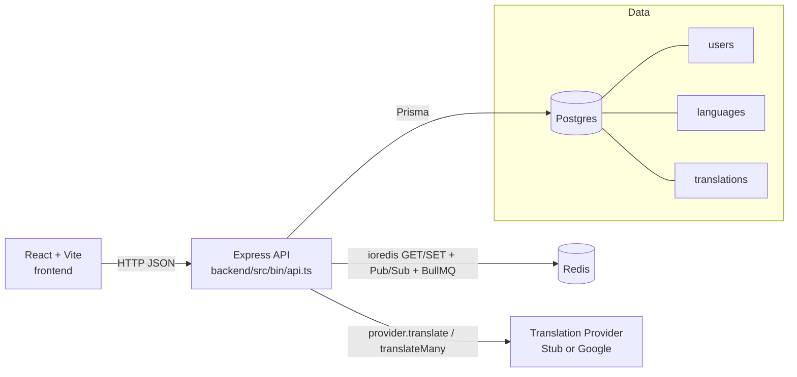
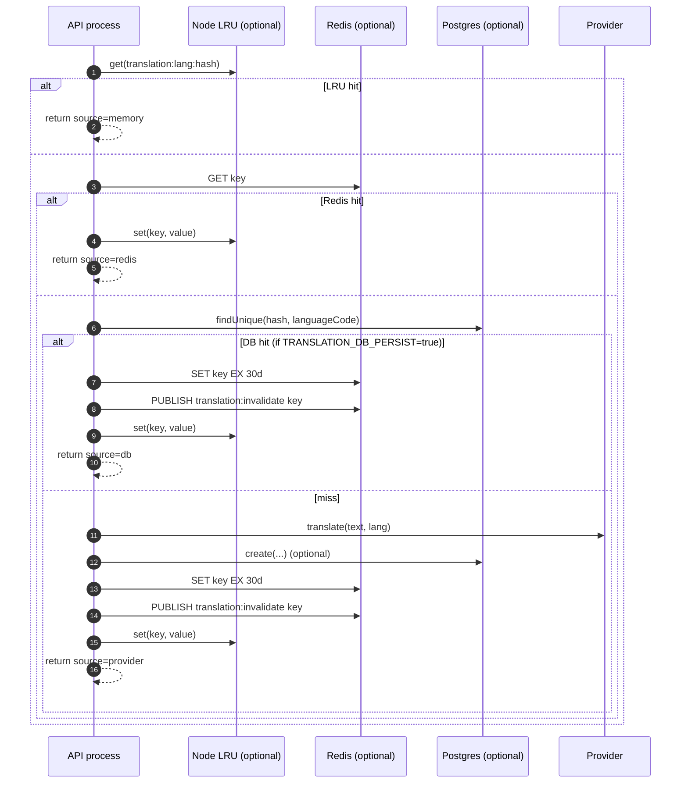
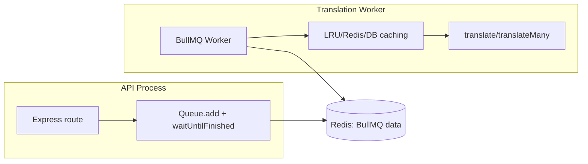

# Architecture

## Overview

This system enables multilingual support for:

- **Static UI text** (predefined translations in the frontend via i18n)
- **Dynamic user-generated content** (translated on-demand using a translation pipeline)

It is optimized for:

- **Minimal translation API cost** (hash dedupe + cache)
- **High scalability** (bulk batching + queue + caching)
- **No schema explosion** (no per-language columns)
- **Fast retrieval** (Redis hot cache + optional in-process LRU)

---

## Current implementation at a glance

This workspace is a small full-stack app with:

- **Frontend**: React + Vite (`frontend/`)
- **Backend API**: Express + TypeScript (`backend/`)
- **Database**: Postgres (Prisma)
- **Cache / coordination**: Redis (cache + Pub/Sub + BullMQ)
- **Translation provider**: Stub or Google Translate v2

The core product behavior is: **a user has a preferred language**; whenever a user is returned by the API, the response may include a `localized.translatedObject` containing translated versions of whitelisted fields (e.g. `address`, `notes`) for the user’s preferred language, while keeping the original fields intact.

---

## High-level component diagram



---

## Repository layout

### Backend (`backend/`)

- **Entry points (bin)**:
  - API: `backend/src/bin/api.ts`
  - BullMQ worker: `backend/src/bin/worker.translation.ts`
  - Global batcher worker: `backend/src/bin/worker.translation-batcher.ts`
- **Composition root**:
  - Bootstrap/wiring: `backend/src/app/bootstrap.ts`
  - Express server + route mounting: `backend/src/app/http/server.ts`, `backend/src/app/http/routes.ts`
- **Modules (routers/controllers)**:
  - Users: `backend/src/modules/users/users.router.ts`
  - Languages: `backend/src/modules/languages/languages.router.ts`
  - Translate: `backend/src/modules/translate/translate.router.ts`
- **Infrastructure**:
  - Prisma client: `backend/src/infra/prisma/client.ts` (+ schema in `backend/prisma/schema.prisma`)
  - Redis client: `backend/src/infra/redis/client.ts`
- **Translation implementation (core)**:
  - Provider abstraction: `backend/src/translate/provider.ts`
  - Single translate w/ cache: `backend/src/translate/service.ts`
  - Bulk translate w/ cache: `backend/src/translate/bulk.ts`
  - BullMQ producer/worker glue: `backend/src/translate/bullmq.ts`
  - LRU invalidation Pub/Sub: `backend/src/translate/redis-invalidate-sub.ts`
  - Global cross-request batching:
    - Client helpers: `backend/src/translate/global-batcher.ts`
    - Batcher loop: `backend/src/translate/global-batcher-worker.ts`

### Frontend (`frontend/`)

- App entry: `frontend/src/main.jsx`, `frontend/src/App.jsx`
- Main UI: `frontend/src/components/Navbar.jsx`, `frontend/src/pages/MainPage.jsx`
- API client: `frontend/src/api/http.js`
- Query hooks: `frontend/src/api/users.js`, `frontend/src/api/languages.js`
- i18n resources: `frontend/src/i18n.js`

---

## Data model (Postgres via Prisma)

Defined in `backend/prisma/schema.prisma`:

- **`User`**
  - `userId` (string, primary key)
  - `address` (nullable string)
  - `notes` (nullable string)
  - optional `languageId` → `Language`
- **`Language`**
  - `code` (`en`, `fr`, `gr`, etc.)
  - `name`
- **`Translation`** (translation memory)
  - `hash` = `sha256(sourceText + \"|\" + sourceLanguageCode + \"|\" + targetLanguageCode)`
  - `sourceLanguageCode` (detected)
  - `targetLanguageCode` (requested)
  - `translatedText`
  - Unique constraint: **`(hash, sourceLanguageCode, targetLanguageCode)`**

This design makes translation lookups cheap by keying on `(hash, languageCode)` and avoiding full-text indexes for this demo.

### Intended “full” translation table (design)

For large-scale production dynamic content, the commonly recommended shape is closer to:

- `hash` = `hash(sourceText + targetLanguageCode)` (or equivalent)
- `sourceText`
- `translatedText`
- `sourceLanguageCode`
- `targetLanguageCode`
- optional: `userId` (who created the source text) and `createdAt`
- optional: `needsTranslation` (for async/queued pipelines)

**Note:** this repo now implements the `sourceLanguageCode`/`targetLanguageCode` approach, but language detection is intentionally conservative and only supports the app’s supported languages.

---

## Backend API surface

Implemented in `backend/src/bin/api.ts` and module routers:

- `GET /health`: liveness (process up; does not require DB)
- `GET /ready`: readiness (checks DB with `SELECT 1`)
- `GET /languages`: list languages
- `GET /users`: list users
- `GET /users/:userId`: fetch single user (includes `language`)
- `PUT /users/:userId`: upsert address/notes
- `PUT /users/:userId/language`: set preferred language
- `POST /translate`: translate one string
- `POST /translate/bulk`: translate up to 100 strings in one request

---

## Frontend flow (UI → API)

### Navbar

`frontend/src/components/Navbar.jsx`:

- Loads **users** (`GET /users`) and **languages** (`GET /languages`).
- Stores the selected userId in `localStorage` key **`user`**.
- When language changes, it calls `PUT /users/:userId/language`.
  - On success it broadcasts `window` event **`blys:userUpdated`** so the form refreshes.
- Also keeps the UI language in sync with the selected user’s `language.code` using `i18next`.

### Main page form

`frontend/src/pages/MainPage.jsx`:

- Reads `userId` from local storage and fetches `GET /users/:userId`.
- Allows editing `address` + `notes`.
- Save calls `PUT /users/:userId`.
- For display, it prefers `user.localized.translatedObject.address/notes` when present.
- Default display is translated when available; a checkbox toggle allows showing the original.
- On `blys:userUpdated`, it clears local drafts so the UI reflects server-side response updates.

---

## Translation architecture

There are three distinct concerns:

1. **How translation results are stored** (LRU/Redis/DB)
2. **How translation work is performed** (provider calls, bulk batching, debouncing)
3. **How concurrency is controlled** (BullMQ queue + worker)

## Core principles (design rules)

### 1) Avoid per-language columns

Do **not** add columns like `address_fr`, `address_gr`, etc. That leads to schema bloat and complex queries.

**Instead:** store translations in a dedicated translation table keyed by a deterministic hash.

### 2) Avoid excessive translation API calls

Translation providers are expensive at scale. Re-translating identical text is waste.

**Instead:** cache aggressively and dedupe by hash, and use bulk processing to reduce overhead.

### 3) Split static vs dynamic translations

- **Static UI text**: frontend i18n (`frontend/src/i18n.js`)
- **Dynamic user input**: translation pipeline (cache + DB + provider)

---

## Translation pipeline (dynamic content)

### Translation keys (deduplication)

Both single and bulk share the same deterministic key scheme:

- `hash = sha256(sourceText + \"|\" + sourceLanguageCode + \"|\" + targetLanguageCode)`
- Redis key: **`translation:${sourceLanguageCode}:${targetLanguageCode}:${hash}`**

This supports:

- **Cache lookup** (Redis)
- **DB lookup** (`translations` table)
- **Cross-service reuse** (same text + target language → same key)

### “Read-time” translation rule

Dynamic content translation is **lazy / on-demand**:

- **Do not translate everything at write time**
- Translate **only when a consumer needs a specific target language**

This reduces cost when many languages exist but only a subset is ever requested.

### Language detection + “do not translate” heuristics (implemented)

Dynamic translation does a pre-check before calling the provider:

- **Non-translatable heuristic**: emails/URLs/numbers/punctuation-only/very-short strings are returned unchanged.
- **Language detection**: detect source language (conservative threshold); if it equals the target language, skip translation.

Implementation: `backend/src/translate/detect.ts`

### Cache tiers (single translate)

Implemented in `backend/src/translate/service.ts`:



### Bulk translation

Implemented in `backend/src/translate/bulk.ts` and exposed via `POST /translate/bulk`:

- **LRU**: per-item lookup
- **Redis**: one `MGET` for all missing keys
- **DB**: one `findMany` with `OR` on `(hash, languageCode)` pairs
- **Provider**:
  - deduplicates identical inputs by `hash`
  - calls `provider.translateMany()` in chunks (`TRANSLATION_BULK_CHUNK`)
  - optional debounce (`TRANSLATION_DEBOUNCE_MS`) before provider calls
- Writes:
  - DB: `createMany(skipDuplicates: true)` (when enabled)
  - Redis: `SET EX 30d` and `PUBLISH translation:invalidate <key>`

### Provider abstraction

`backend/src/translate/provider.ts` defines:

- `translate({ text, targetLanguage })`
- `translateMany(texts[], targetLanguage)` (order-preserving)

Providers:

- **StubTranslationProvider**: returns `"[lang] ${text}"` (for local testing)
- **GoogleTranslationProvider**: uses `@google-cloud/translate` v2; bulk uses array form.

---

## Concurrency and background work: BullMQ

BullMQ is used to avoid doing heavy translation provider work directly on the request thread when enabled.

## Cross-request batching (global batching window)

Problem: even with per-request bulk translation, **many concurrent single-string misses** can still fan out to many provider calls.

Solution: a Redis Streams based **global batching layer** batches cache-miss provider work across requests/processes:

- Streams: `itl:translation:req:<lang>` (one per target language)
- Response keys: `itl:translation:resp:<requestId>` (short TTL)
- Batcher worker: consumes requests within a ~10ms window and calls `provider.translateMany()` once per batch.
- Call site: on single translate cache misses, the API enqueues + waits (bounded) and falls back to direct provider call on timeout.

Implementation:

- Producer helpers: `backend/src/translate/global-batcher.ts`
- Batcher loop: `backend/src/translate/global-batcher-worker.ts`
- Worker entrypoint: `backend/src/bin/worker.translation-batcher.ts`

Key env knobs:

- `TRANSLATION_GLOBAL_BATCHING` (set `false` to disable)
- `TRANSLATION_GLOBAL_BATCH_WINDOW_MS` (default 10, max 50)
- `TRANSLATION_GLOBAL_BATCH_MAX` (default 200)
- `TRANSLATION_GLOBAL_BATCH_WAIT_TIMEOUT_MS` (default 1500ms)
- `TRANSLATION_GLOBAL_BATCH_RESP_TTL_SEC` (default 120s)
- `TRANSLATION_GLOBAL_BATCH_LOG` (set `true` to log batch sizes)

### What runs where

`backend/src/translate/bullmq.ts` provides two “call sites”:

- **Producer** (API process)
  - creates `Queue` + `QueueEvents`
  - submits jobs and waits for results using `job.waitUntilFinished(...)`
- **Worker**
  - consumes the queue and performs the translation (including cache writes)

Jobs:

- `single`: calls `translateWithCache(...)`
- `bulk`: calls `translateBulkWithCache(...)`

### Runtime modes

`backend/src/app/bootstrap.ts` (wired from `backend/src/bin/api.ts`):

- If `REDIS_URL` is set:
  - starts BullMQ producer
  - optionally starts an in-process worker (default)
- If `RUN_TRANSLATION_WORKER=false`:
  - you run a separate worker process using `backend/src/bin/worker.translation.ts`

If BullMQ is disabled (`TRANSLATION_USE_BULLMQ=false`) the API calls translation inline (still using the same caching logic).



---

## LRU staleness & Redis Pub/Sub invalidation

Problem: Node LRU is **per process** and can become stale if another process updates Redis for the same key.

Solution: `backend/src/translate/redis-invalidate-sub.ts`

- Channel: **`translation:invalidate`**
- Whenever this backend writes a translation key to Redis, it also:
  - `PUBLISH translation:invalidate <key>`
- Each API process starts a **subscriber connection** (separate from the normal Redis client) and calls:
  - `LRU.delete(<key>)`

This makes Redis the “global truth” and keeps local caches safe.

---

## Localized response shape (dynamic fields)

For endpoints returning a user, the backend keeps the original user fields and (when translation is required) attaches:

```json
{
  "userId": "user1",
  "address": "Bonjour",
  "notes": "…",
  "language": { "code": "fr", "name": "French" },
  "localized": {
    "language": "fr",
    "translatedObject": {
      "address": "Hello",
      "notes": "…"
    }
  }
}
```

Only fields listed in `TRANSLATABLE_USER_FIELDS` are included in `localized.translatedObject`.

---

## Configuration (env)

Backend configuration lives in `backend/.env` and documented in `backend/.env.example`.

Key vars (translation-related):

- **Redis/DB**
  - `DATABASE_URL`
  - `REDIS_URL`
  - `TRANSLATION_DB_PERSIST` (default true)
- **LRU**
  - `TRANSLATION_LRU_MAX` (0 disables in-process caching)
- **BullMQ**
  - `TRANSLATION_USE_BULLMQ` (default true)
  - `RUN_TRANSLATION_WORKER` (default true in API process)
  - `TRANSLATION_QUEUE_CONCURRENCY`
  - `TRANSLATION_JOB_TIMEOUT_MS`
  - `TRANSLATION_BULK_JOB_TIMEOUT_MS`
- **Bulk behavior**
  - `TRANSLATION_BULK_CHUNK`
  - `TRANSLATION_DEBOUNCE_MS`
- **Provider**
  - `TRANSLATION_PROVIDER=stub|google`
  - Google credentials via `GOOGLE_APPLICATION_CREDENTIALS` or JSON env.
  - `TRANSLATABLE_USER_FIELDS` (comma-separated list of user fields to localize at response-time)

---

## Local dev / Docker runtime

Backend `docker-compose.yml` runs:

- `postgres`
- `redis`
- `app` (Express)

